  
  &nbsp;&nbsp;&nbsp;
  
  &nbsp;&nbsp;&nbsp;
  

 

> **Full Stack Developer** building scalable web applications with modern JavaScript ecosystems.
> Currently architecting micro-frontend & SSO solutions at **Irtiqa Business Solutions**.
> BS Computer Science — COMSATS University, Islamabad.

 

## Stack

**Languages & Runtime**

<kbd>JavaScript</kbd> &nbsp; <kbd>TypeScript</kbd> &nbsp; <kbd>HTML5</kbd> &nbsp; <kbd>CSS3</kbd> &nbsp; <kbd>GraphQL</kbd>

**Frameworks**

<kbd>React</kbd> &nbsp; <kbd>Next.js</kbd> &nbsp; <kbd>Node.js</kbd> &nbsp; <kbd>Express.js</kbd> &nbsp; <kbd>NestJS</kbd> &nbsp; <kbd>MongoDB</kbd> &nbsp; <kbd>Supabase</kbd>

**UI & Design Systems**

<kbd>Tailwind CSS</kbd> &nbsp; <kbd>SCSS</kbd> &nbsp; <kbd>Material UI</kbd> &nbsp; <kbd>Shadcn/ui</kbd> &nbsp; <kbd>Ant Design</kbd> &nbsp; <kbd>NextUI</kbd> &nbsp; <kbd>Storybook</kbd>

**Cloud & Tooling**

<kbd>AWS</kbd> &nbsp; <kbd>GCP</kbd> &nbsp; <kbd>Vercel</kbd> &nbsp; <kbd>Docker</kbd> &nbsp; <kbd>Stripe</kbd> &nbsp; <kbd>Git</kbd> &nbsp; <kbd>Postman</kbd> &nbsp; <kbd>Swagger</kbd>

 

## Experience

**Irtiqa Business Solutions** — Full Stack Developer &nbsp; `Sep 2023 – Present`
 Micro-frontend & micro-services architecture · SSO with React · REST APIs with NestJS · AWS & Vercel deployments

**Xint Solutions** — Frontend Developer &nbsp; `Mar 2023 – Aug 2023`
 React/Next.js feature development · Google Maps integration · Clean, standards-driven code

**Selteq IT Solutions** — Full Stack Developer &nbsp; `Mar 2021 – Mar 2023`
 Booking system APIs with Node.js · Admin dashboards · Reusable component architecture

 

## Featured Projects

<table>
<tr>
<td width="100%" valign="top">

### TraderOS &nbsp; 🔥 Active
React · TypeScript · NestJS · Supabase · Stripe · Redux Toolkit · RTK Query · MUI · Tailwind · Chart.js · AWS ECS

Subscription-based SaaS trading platform — real-time market intelligence, 18+ technical analysis report types, AI-powered strategy builder with backtesting, economic calendar, and a credit-based billing system powered by Stripe. Full-stack: React frontend with advanced charting + NestJS backend deployed on AWS ECS via CI/CD.

</td>
</tr>
</table>

<table>
<tr>
<td width="50%" valign="top">

### LYCA Audit Tool
TypeScript · React · NestJS · MongoDB · Redux · RTK Query

Full-stack audit platform — NestJS APIs powering React frontend for audit workflows, client management, and engagement tracking.

</td>
<td width="50%" valign="top">

### Plexaar CRM
JavaScript · React · Node.js · MongoDB · Storybook

VoIP-powered CRM — REST APIs for booking & staff management, React frontend with Redux state management.

</td>
</tr>
<tr>
<td width="50%" valign="top">

### My Docile
TypeScript · Next.js · Express.js · MongoDB · AWS

Investment platform with product purchasing and withdrawal. Full-stack development deployed on AWS EC2.

</td>
<td width="50%" valign="top">

### Traddoo Trading App
Next.js · MUI · Tailwind · Chart.js · GraphQL

Trading platform with real-time charts and GraphQL API integration. Built responsive UI with data visualizations.

</td>
</tr>
</table>

 

---

  
  

  

---

  Building things that matter, one commit at a time.

